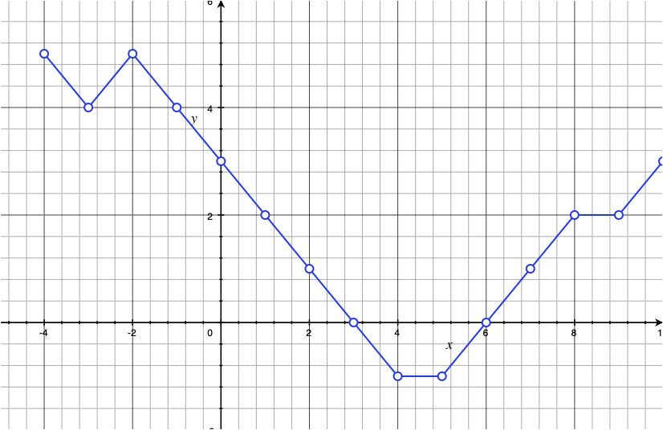
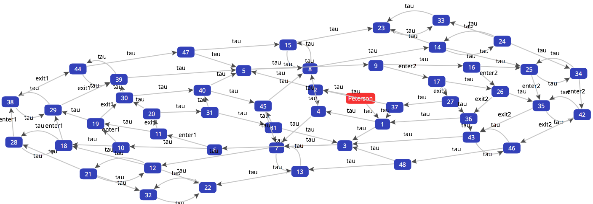

## Distributed Java Programming 
---
### CM 2: Threads
1. Concurrent programs
2. Threads
3. Runnable and callable 
4. Synchronization 
5. Pools of threads 
---
### Concurrency
- Applications should perform _several tasks_ at the __same time__.
- Specially when _IO operations_ are involved. 
- This lesson: Java support for high-level concurrency API

More information and examples [here](https://docs.oracle.com/javase/tutorial/essential/concurrency/index.html)
---
### Concurrent programs

Much more difficult than sequential programs: 
- Very difficult to debug
- _Race conditions_ 
 - __unexpected__ results depending on the __order__ of execution
- Deadlocks and livelocks. 
- Memory consistency errors. 
- ...

> So, be _careful_ and use __formal methods__ ;-)
---
### Concurrent programs

A simple program: 
- Find the zero of an integer function
- We can assume that there exists `x` s.t. `f(x)=0`



---
### Concurrent programs (1)
```java
// Positive integers
found = false;
x=0;
while(not found){
  x++;
  found = f(x)==0;
}
```
<!-- .element: style="text-align: left; float: left; width: 48%" -->

```java
// Negative integers
found = false;
y=1;
while(not found){
  y--;
  found = f(y)==0;
}
```
<!-- .element: style="float: right; width: 48%" -->

- `found` and `f` are _shared_ by the programs
- Does the __concurrent__ execution `S1 | S2` find the zero of `f`?
---
### Concurrent programs (2)
```java
// Positive integers
found = false;
x=0;
while(not found){
  x++;
  if (f(x) ==0) found = true;
}
```
<!-- .element: style="text-align: left; float: left; width: 48%" -->

```java
// Negative Integers
found = false;
y=1;
while(not found){
  y--;
  if (f(y) ==0) found = true;
}
```
<!-- .element: style="float: right; width: 48%" -->

- `found` and `f` are _shared_ by the programs
- Does the __concurrent__ execution `S1 | S2` find the zero of `f`?
---
### Concurrent programs (3)
```java
// Positive Integers
x=0;
while(not found){
  x++;
  if (f(x) ==0) found = true;
}
```
<!-- .element: style="text-align: left; float: left; width: 48%" -->

```java
// Negative Integers
y=1;
while(not found){
  y--;
  if (f(y) ==0) found = true;
}
```
<!-- .element: style="float: right; width: 48%" -->

- `found` and `f` are _shared_ by the programs
- Does  `found=false ; (S1 | S2)` find the zero of `f`?

---
### Concurrent programs
- _Sequential_ techniques do not work very well in the concurrent setting. For instance, 

```java
// Program 1
x = 2 ;
.
```
<!-- .element: style="text-align: left; float: left; width: 48%" -->

```java
// Program 2
x = 1 ;
x += 1 ;
```
<!-- .element: style="text-align: left; float: right; width: 48%" -->
- Semantically, `P1` and `P2` are _equivalent_. 
- Hence, we may replace them in bigger contexts.
- `while (B){P1}`  _behaves_ as ` while(B){P2}`
- What about these two programs?
1. `x=2 | P1 ` 
2. `x=2 | P2` 

---
# Threads 
---
### Threads
- Many applications require concurrent executions.
- Think about a cloud system: 
 * Many users request files _simultaneously_ 
 * Users should not _wait_ for too long to get access to the files
 * A user can download several files at the _same time_. 

---
### Threads
- Many applications require concurrent executions.
- Think about a cloud system: 
- But also extra difficulties show up:
 * What about 2 users modifying the same file?
 * Denial-of-service attacks 
 * Replication of data
 * ...

---
### Threads
Two ways of implementing concurrent executions:
#### Processes
 * No shared memory
 * Inter Process Communication (__IPC__)
 * Usually heavier 

#### Threads
 * _Lightweight_ processes (fewer resources on creation).
 * Memory is shared 
 * The Java Virtual machine creates a single process (running several threads). 
 * Every Java program has at least one thread... The _main thread_. This thread
 may create other threads. 
---
### Threads
- Threads are a  good solutions to launch __asynchronous__ tasks. 
- It is possible to use _executors_ to manage the concurrent executions  (more on this later). 
---
### Threads
A thread might be in different states:
- __New__: when it is created (and not yet started)
- __Runnable__: After _started_, it is ready to execute.
- __Blocked__: if it is waiting for a _lock_
- __Waiting__: if it is waiting for a _notification_
- __Timed waiting__: when _timeouts_ are used
- __Terminated__: (un)successful termination of the task. 

---
### Threads
A thread that does not do much:
```java
public class Example1{
 public static void main(String arg[]){
   Thread T = new Thread(); // Creating the thread
   System.out.println(T.getState());
   T.start(); // Starting execution
   System.out.println(T.getState());
   try{
       T.join(); // Wait for this thread to die
       System.out.println(T.getState());
   }
   catch(InterruptedException E){
       System.out.println(E);
   }
```
---
### Start and Join
#### Start
- Begins the execution.
- Note: constructing a thread __does not mean executing it__. 

#### Join
- The method `join` __wait__ for the completion of a thread. 
- The current thread __pauses__ its executing until the other thread terminates. 
- This method can be used to implement a  __barrier synchronization__.  

---
### Threads
Extending the class `Thread`
```java
public class Example2 extends Thread {
    private String msg;
    private int num, delay;
    public Example2(String msg,int num, int delay){
        this.msg = msg; ...
    }
    @Override
    public void run(){
        for(int i=1;i<=this.num;i++){
            System.out.println(i + ". " + this.msg  );
            try{ // Suspending the execution 
                Thread.sleep(this.delay);
            }
            catch(InterruptedException e){ ... }
            }
    ...
    public static void main(String arg[]){
        Example2 EH = new Example2("Hello", 10,1000);
        Example2 EW = new Example2("World", 10, 300);
        EH.start();
        EW.start();
    }
}
```

--- 
### Thread.sleep
- Invoking `Thread.sleep` makes the processor available to other threads. 
- You do not have any guarantee that the sleeping time will be _exactly_ the parameter used. 
- This method may throw `InterruptedException`... Since Threads can be __interrupted__. 

---
### Interrupting threads
An example of interrupting a thread (`Interrupt.java`)

```java
class Signal extends Thread{
    private String m;
    public Signal(String m){ this.m = m;}

    public void run(){
        try{
            while(true){
                System.out.println(this.m);
                Thread.sleep(1000);
                }
            }
        catch(Exception E){
            System.out.println("Thread interrupted...");
            System.out.println(E);
        }
    }
}
class Interrupt{
        
    public static void main(String arg[]){
        Signal S = new Signal("beep");
        S.start();
        try{
            Thread.sleep(4000);
            S.interrupt();
            }
        catch(Exception E){
            System.out.println(E);
        }

    }
}
```

---
### Threads
Instead of _extending_ `Thread`, it is possible to __implement__  `Runnable`: 
```java
public class Example3 implements Runnable {
    private String msg;
    private int num, delay;
    public Example3(String msg,int num, int delay){
		...
    }

    @Override
    public void run(){
        for(int i=1;i<=this.num;i++){
			...
        }
    }

    public static void main(String arg[]){
        Example3 EH = new Example3("Hello", 10,1000);
        Example3 EW = new Example3("World", 10, 300);
        Thread T1 = new Thread(EH);
        Thread T2 = new Thread(EW);
        T1.start();
        T2.start();
    }
}
```
---
### Thread vs Runnable
- Extending thread is usually simpler. 
- But remember that Java does not support multiple-inheritance. 
- The interface __Runnable__ separates the _task_ to be accomplished  from the object Thread that _executes_ that task.

---
### Threads
For identification purposes, a name is assigned to
threads. 

```java
public void run(){
	...
		System.out.println(this + ". " +  this.msg);
	...

public static void main(String arg[]){
	Example4 E1 = new Example4("Hello", 10,500);
	Example4 E2 = new Example4("Hello", 10,500);
	E1.setName("My-thread ");
	E1.start();
	...
```

The method `Thread::toString` uses that name:
```
Thread[My-thread ,5,main].
```
---
### Threads
- The `5` in the previous output is the _priority_ of the thread.

- Threads with higher priority are executed in preference to threads with lower priority. 

- `public static final int NORM_PRIORITY` (5) 
- `public static final int MAX_PRIORITY` (10) 
- `public static final int MIN_PRIORITY` (1) 

---
### Race conditions
Consider the following class:
```java
public class Example5 extends Thread {
    public static int sum = 0 ;
    public int step, n;

    public Example5(int step, int n){
        this.step = step;
        this.n = n;
    }

    @Override
    public void run(){
        for(int i=1;i<=this.n;i++){
            Example5.sum += this.step;
        }
    }
```
---
### Race conditions
What if we execute:
```java
Example5 E1 = new Example5(1,10000);
Example5 E2 = new Example5(-1,10000);
E1.start();
E2.start();
try{
	E1.join();
	E2.join();
}
catch(Exception E){
	System.out.println(E);
}
System.out.println("Sum: " + Example5.sum);
```
What is the final value of `Example5.sum` ?

---
### Synchronization
- Threads __communicate__ by _sharing_ objects. 
- This is quite efficient but we may have _thread interference_ and _memory consistency errors_
- The access of the _shared resource_ must be __synchronized__. 
- The value _read_ by the Thread must be used to _write_ the new value
- Executing __all__ the operations of `E1` and only then the operations on `E2` is not an option (lost of concurrency). 
```java
// Sequential execution
E1.start();
E1.join();
E2.start();
E2.join();
```
- What can we do?
---
### Synchronization
__Thread interference:__
- Threads _interleave_ 
- Data is _shared_
- Operations are not necessarily _atomic_. 

__Memory Consistency Errors:__
- Inconsistent views of the memory (e.g., cache). 
- There is __no control__ of the _ordering_ of the events. 
- What value should I read? Before or after the execution of another thread?
- Synchronization  mechanisms must impose a _happens-before relationship_ (e.g., `join`).

---
### Synchronized methods
```java
class Data{
    public static int sum = 0 ;
    public static synchronized 
        void update(int step){
        Data.sum += step;
    }
}
public class Example6 extends Thread {
	...
    @Override
    public void run(){
        for(int i=1;i<=this.n;i++){
            Data.update(this.step);
        }
    }
```
---
### Synchronized methods
- A simple strategy for preventing _thread interference_.
- Two invocations of a synchronized method on the same object __cannot interleave__
- If a thread is currently executing the synchronized method, all other threads invoking _any_ synchronized methods on the same object _block_ (__suspending__ their execution). 
- This establishes a __happens-before__ relationship with any subsequent invocation of a synchronized method for the same object.

---
### Locks and critical section (MUTEX: Dijkstra'65)
- The _critical section_ is executed by a single process at a time. 
-  All processes follow the protocol below:
1. Win a competition to get the _lock_
2. Execute the _critical section_
3. __Release__ the lock.
---
### Locks and critical section (MUTEX: Dijkstra'65)

 The MUTEX problem consists in implementing operations `acquire` and `release` such that:
1. _Safety_ (mutual exclusion): At most one process at a time executes the CS
2. _Liveness_ (starvation freedom): Each invocation of `acquire` eventually terminates. 

> Why is liveness needed ? What would it be a _safe_ algorithm to solve mutex without liveness?
---
### Locks and critical section
- Safety is about __invariants__: nothing bad will happen.
- Liveness: something good will _eventually happen_.
---
### Critical section
Peterson algorithm  for 2 processes: 
```
// j = i+1 mod 2
acquire(i) :
  flag[i] := up // I want to enter
  after_you := i // you go first
  wait(flag[j] = down \/ after_you <> i)
  return

release(i) :
  flag[i] := down
```
---
### Critical section
Peterson algorithm  for 2 processes: 


---
### Locks
A _lock_ is a tool for controlling the access to a shared resource by multiple threads (`Example7.java`)

```java
class Data{
    public static int sum = 0 ;
    public static final Lock L = new ReentrantLock();
    public static void update(int step){
        try{
            L.lock();
            Data.sum += step;
            L.unlock();
           }
        catch(Exception E){
            System.out.println(E);
        }
    }
}
```

---
### Locks
A closer look: enter/exit the critical section
```java
// Example 8
class Data{
    public static int sum = 0 ;
    public static final Lock L = new ReentrantLock();
    public static void update(int step){
        try{
            L.lock();
            System.out.println(Thread.currentThread() + " enter.");
            Data.sum += step;
            Thread.sleep(2000);
            System.out.println(Thread.currentThread() + " exit.");
            L.unlock();
           }
        catch(Exception E){
            System.out.println(E);
        }
    }
}
```
---
### Synchronization on objects
It is possible to write _synchronized_ blocks/statements (`Example9.java`)
```java
class Data{
    private int sum = 0 ;
    public int getSum(){return this.sum;}
    public void setSum(int sum){this.sum = sum;}
}
public class Example9 extends Thread {
	...
    public void run(){
        for(int i=1;i<=this.n;i++){
        synchronized(this.D){
            int temp = this.D.getSum();
            D.setSum(temp + this.step);
            }
        }
  ...
        Data D = new Data();
        Example9 E1 = new Example9(1,10000,D);
        Example9 E2 = new Example9(-1,10000,D);
```
---
### Synchronized statements
- Every object has an __intrinsic lock__ with it. 
- Synchronized methods, when invoked, try  to acquire the intrinsic lock  of the object (and _wait_ if needed). 
- Classes have also intrinsic locks (to handle synchronized _static_ methods)
- A synchronized statement also needs to acquire the intrinsic lock of the object. 

---
### Synchronized methods vs synchronized statements
- Consider two operations `inc1` and `inc2`
- These operations act on _different_ resources
- Hence, it is legal to observe the concurrent execution of them
- But two different threads __cannot__ execute `inc1` (on the __same__ object) at the same time (the same for `inc2`). 
---
### Synchronized methods vs synchronized statements

- We can  achieve a  _fine grained synchronization_
- But better to know what we are doing! (`Inc1Inc2.java`)

```java
public class Inc1Inc2 {
    private long c1 = 0;
    private long c2 = 0;
    // Two objects used for synchronization purposes
    private Object lock1 = new Object();
    private Object lock2 = new Object();

    public void inc1() {
        synchronized(lock1) { c1++; }
    }
    public void inc2() {
        synchronized(lock2) { c2++; }
    }
...
```
---
### An example using lambdas
```java
public class Example10 {
    public static int sum;
    public static synchronized void inc(){
        Example10.sum += 1;
    }
    public static synchronized void dec(){
        Example10.sum -= 1;
    }
    public static void main(String arg[]){

        Runnable inc = () ->{
                    for(int i=1;i<10000;i++) Example10.inc();
                        };
        Runnable dec = () ->{
                    for(int i=1;i<10000;i++) Example10.dec();
                        };
                        

        Thread T1 = new Thread(inc);
        Thread T2 = new Thread(dec);
```

---
### Lambdas

A further example... Does it always return 0?

```java
// ThreadLambda.java
class Data{
    int sum = 0;
    public void inc(int x){ this.sum += x; }
    public synchronized void dec(int x){ this.sum -= x; }
    public int get(){ return this.sum; }
}

public class ThreadLambda {
    public static void main(String arg[]){
        Data d = new Data();
        Runnable inc = () ->{
            for(int i=1;i<1000;i++) d.inc(1); };
        Runnable dec = () ->{
            for(int i=1;i<1000;i++) d.dec(1); };

        // start, join etc
        // print d.get()
```

---
### Returning Values
- Methods `run` and `start` do not return a value.
- How can we know the result of a (long) computation?
- Note also that `start` is a __non-blocking__ operation. 

---
### Returning values
This does not work!
```
public class Example11 extends Thread{
        private double result;

        public double getResult(){
            return this.result;
        }

        public void run(){
            try{
                // Long computation computing PI
                Thread.sleep(3000);
                System.out.println("Ready!");
                this.result = Math.PI ;
            }
            catch (Exception E){
                System.out.println(E);
            }
    }
    public static void main(String arg[]){

        Example11 T1 = new Example11();
        T1.start();
        System.out.println(T1.getResult());
    }
```
---
### Returning values

We may use flags to check whether the process finished: 
```
while(T1.isDone()==false){
	Thread.sleep(2000);
}
// The computation has finished
```
But what if `T1` ends before 2 seconds? We are __wasting__ computation time. 

---
### Returning values
Alternatively, we can use `join` as we did before: 
```java
        T1.start();
        try{
            T1.join();
            System.out.println(T1.getResult());
        }
```
There is a _barrier_ that must be passed before printing the result. 
---
### Returning values
At the end of the computation, the method `run` may
inform the result to other class (`Example12.java`).
```java
class ComputingPI extends Thread{
    public void run(){
        try{
            // Long computation computing PI
            Thread.sleep(3000);
            System.out.println("Ready!");
            Example12.newResult(Math.PI);
        }
        catch (Exception E){
            System.out.println(E);
        }
    }
}
public class Example12 {

    public static void newResult(double R){
        System.out.println("Result: " + R);
    }
    
    public static void main(String arg[]){

        ComputingPI T1 = new ComputingPI();
        T1.start();
    }
```
---
### Returning values
As the previous one but without static methods (`Example13.java`):
```java
class ComputingPI extends Thread{
    private Example13 E;
    public ComputingPI(Example13 E){
        this.E = E ;
    }
    public void run(){
        try{
            // Long computation computing PI
            Thread.sleep(3000);
            System.out.println("Ready!");
            this.E.newResult(Math.PI);
        }
        catch (Exception E){
            System.out.println(E);
        }
    }
}
public class Example13 {

    public void newResult(double R){
        System.out.println("Result: " + R);
    }
    
    public static void main(String arg[]){
        Example13 E = new Example13();
        ComputingPI T1 = new ComputingPI(E);
        T1.start();
```
---
### Returning values
- What we did is a very common task. 
- This is the _observable_ pattern: objects register their interests in some _events_. 
- This is the purpose of the interface `Callable`
- Different from `Runnable`, `Callable` returns a _Future_ that can be
used to inspect the result of a computation. 

---
### Interface Callable
```java
import java.util.concurrent.*;

class ComputingPI implements Callable< Double >{
    public Double call(){
        try{
            // Long computation computing PI
            Thread.sleep(3000);
            System.out.println("Ready!");
        }
        catch (Exception E){
            System.out.println(E);
        }
        return Math.PI;
    }
}
public class Example14 {

    public static void main(String arg[]){
        try{
             ExecutorService service = Executors.newFixedThreadPool(2);
             Future< Double > value = service.submit(new ComputingPI());
             System.out.println("Invoking get on the future");
             System.out.println(value.get());
             System.out.println("After get");
             service.shutdown();
        }
        catch(Exception E){
            System.out.println(E);
        }
    }

}
```
---
### Submitting several tasks
`Example15.java`
```java
class ComputingSum implements Callable< Double >{
    private double[] data ;
    int ini, end;

    public ComputingSum(double[] data, int ini, int end){
        this.data = data ;
        this.ini  = ini;
        this.end  = end;
    }
    public Double call(){
        double result = 0;
        try{
            // Long computation of sum
            for(int i=ini; i < end ; i++){
                result += this.data[i];
                Thread.sleep(500);
            }
            System.out.println("Ready!");
        }
        catch (Exception E){
            System.out.println(E);
        }
        return result;
    }
}
public class Example15 {

    public static void main(String arg[]){
        double data[] = {1,2,3,4};
        long start = System.currentTimeMillis();
        try{
             ExecutorService service = Executors.newFixedThreadPool(2);
             ComputingSum C1 = new ComputingSum(data,0,2);
             ComputingSum C2 = new ComputingSum(data,2,4);

             Future< Double > v1 = service.submit(C1);
             Future < Double > v2 = service.submit(C2);
             System.out.println(v1.get() + v2.get());
             service.shutdown();
             long finish = System.currentTimeMillis();
             long timeElapsed = finish - start;
             System.out.println("Time: " + timeElapsed);
        }
        catch(Exception E){
            System.out.println(E);
```
---
### Executors
- The interface _ExecutorService_ encapsulates the management of threads. 
- A more clear __separation of concerns__. 
- Implementations of this interface executes a `Runnable` (or `Callable`) task at some time in the future. 
- The executor _reuses_ existing threads (workers, thread pools).  
- Tasks are submitted to the pool via an internal queue
---
### Producers and consumers
- Consider a buffer of fixed size
- A producer adds items to the buffer
- A consumer _waits_ until the buffer is __full__. Then, it consumes __all__ the elements. 
- The producer _waits_ until the buffer is __empty__ to produce more items. 
- We need mechanisms to _wait_ and _notify_ that something has happened. 

---
### Producers and consumers
First the buffer (with synchronized methods) `ProducerConsumer.java`
```java
class Buffer{
    public final static int size = 4;
    private String [] data;
    private int counter = 0;

    public Buffer(){
        this.data = new String[Buffer.size];
    }
    public boolean isEmpty(){ return this.counter==0;}
    public boolean isFull(){ return  this.counter==Buffer.size;}

    public synchronized void add(String S)
        throws ArrayIndexOutOfBoundsException{
        this.data[this.counter++] = S;
    }

    public synchronized String get()
        throws ArrayIndexOutOfBoundsException{
        return this.data[--this.counter];
   }
}

```
---
### Producers and consumers

The producer has to _wait_ until the buffer is empty

An it _notifies_ when the new elements have been added

```java
class Producer implements Runnable{
    private Buffer B;
    public Producer(Buffer B){ this.B = B;}

    public void run(){
        int n=0;
        while(true){
            synchronized(this.B){
                while(! B.isEmpty()){
					// Wait until being notified
                    try{ B.wait(); }
                    catch(InterruptedException E){
                        System.out.println(E);
                    }
                }
                for(int i=1;i<=Buffer.size;i++){
                    n++;
                    System.out.println("[sending] Message " + n);
                    this.B.add("Message " + n);
                    try{Thread.sleep(600);} catch (InterruptedException E){}
                }
                B.notifyAll();
            }
```
---
### Producers and consumers
The Consumer has to _wait_ until the buffer is full

An it _notifies_ when the items have been consumed

```java
class Consumer implements Runnable{
    private Buffer B;
    public Consumer(Buffer B){ this.B = B;}

    public void run(){
        while(true){
            synchronized(B){
                while(! B.isFull()){
                    try{
                        B.wait();
                        }
                    catch(InterruptedException E){
                        System.out.println(E);
                    }
                }
                for(int i=1;i<=Buffer.size;i++){
                    System.out.println("[receive] " + B.get());
                    try{Thread.sleep(400);} catch (InterruptedException E){}
                }
                B.notifyAll();
            }
```
---
### Producers and consumers
- Now both processes synchronize on the use of the buffer
- _wait_: invoked on a loop checking for a condition to be true
- This is __only possible on synchronized sections__ 
- The thread is suspended until the notification
- Moreover, the lock (on `B`) is _released_
- Other threads can then acquire the lock and eventually _notify_.
- After notification, the lock must be  _reacquied_ and the waiting code resumes its execution. 

---
### Concurrent Collections
- Producing/consuming items on a bounded structure is quite common. 
- The interface `BlockingQueue` defines a Queue  whose
operations `put` and `take` _block_ the execution.
- `BlockingQueue` implementations are _thread-safe_.
---

### Concurrent Collections
`ProdConQueue.java`
```java
class Producer implements Runnable{
    private BlockingQueue< String > Q;
    private int num_messages = 0;
    public Producer(BlockingQueue< String > Q){
        this.Q = Q ;
    }

    public void produce(int i){
        try{
        	this.Q.put("Message " + (this.num_messages++));
			System.out.println("Currently " + Q.size() + " messages in the Queue");

            Thread.sleep(i);
        }
        catch(InterruptedException E){}
    }

    public void run(){
        int n=0;
        Random R = new Random(System.currentTimeMillis());
        R.ints(50,1000)
        	.forEach( i -> produce(i));
    }
}
```
---
### Concurrent Collections
```java
class Consumer implements Runnable{
    private BlockingQueue< String > Q;
    public Consumer(BlockingQueue< String > Q){
        this.Q = Q ;
    }

    public void run(){
        while(true){
			try{
				String m = this.Q.take();
				System.out.println("[rec " + this + "]: " + m);
				Thread.sleep(4500);
			}
			catch(InterruptedException E){
				System.out.println(E);
			}
        }
    }
}

```
---
### Concurrent Collections
```java
class ProdConQueue{
    public static final int nConsumers = 5;
    public static void main(String arg[]){
        BlockingQueue< String > Q = new ArrayBlockingQueue(5);
        for(int i=0;i < ProdConQueue.nConsumers;i++)
            (new Thread(new Consumer(Q))).start();
        
        (new Thread(new Producer(Q))).start();
    }
}

```
---
### Streams and concurrency
- Most of the problems of concurrent executions are due to __shared resources__. 
- If objects are _immutable_, such problems do not exist anymore!
- Processing streams (in a functional way) in parallel is a neat example of that. 

---
### Streams and concurrency
```java
// ConcurrentStream.java
int data[] = new int[] {1,2,3,4,5,6,7,8,9,10};
int sum = Arrays.stream(data)
    . parallel() // Processing the stream in parallel
    . map( ConcurrentStream::compute)
    . sum()
    ;
```
---
### Dining Philosophers
* Problem proposed by _Dijkstra_ for testing concurrency primitives. 
* N philosophers spend their time around a table __thinking__ or __eating__. 
* There is only one fork between each philosopher.
* _Safety_: In order to eat, the philosophers need two forks.
* _Starvation freedom_: if one philosopher gets hungry, he will eventually eat.


---
### Dining Philosophers
- We are looking for _symmetric solutions_: the code of
each Fork and Philosopher __must be the same__. 
- _Synchronization problem_: how to guarantee the correct use of the forks?
--- 
### Dining Philosophers
We consider the following states:
```java
enum STATE_PHILO {THINKING, HUNGRY , EATING;}
enum STATE_FORK {FREE, INUSE;}
```
#### Class Fork
- _take_(): Moving from `FREE` to `INUSE`
- _release()_: Moving from `INUSE` to `FREE`

#### Class Philosopher
- _right/left_: the forks
- _think()_: start thinking
- _hungry()_: getting hungry and taking the forks
- _eat()_: eating and releasing the forks  

---
### Alternative 1: Synchronized methods
We shall "protect" the resources by using _synchronized_ methods:
#### Class Fork
```java
public synchronized void take() throws StateException {
	if (this.state == STATE_FORK.INUSE) 
		throw new StateException();
	this.state = STATE_FORK.INUSE ;
}
public synchronized void release() throws StateException{
	if (this.state == STATE_FORK.FREE) 
		throw new StateException();
	this.state = STATE_FORK.FREE ;
}
```
> An attempt to grab an _already taken_ fork results in
> a `StateException`
---
### Alternative 1: Synchronized methods
We shall "protect" the resources by using _synchronized_ methods:
#### Class Philosopher
```java
public void run(){
	while(true){
		try{
			think(); hungry(); eat();
		}
		catch(Exception E){
			System.out.println(E);
		}
	}
}

```
---
### Alternative 1: Synchronized methods
We shall "protect" the resources by using _synchronized_ methods:
#### Class Philosopher
```java
private void hungry() throws StateException, InterruptedException{
	this.state = STATE_PHILO.HUNGRY;
	right.take();
	left.take();
}

private void eat() throws StateException, InterruptedException{
	this.state = STATE_PHILO.EATING;
	// Sleep for some time
	right.release();
	left.release();
}
```
---
### Alternative 1: Synchronized methods

We shall "protect" the resources by using _synchronized_ methods:

_Does it work?_
---
### Alternative 1: Synchronized methods

We shall "protect" the resources by using _synchronized_ methods:

_Does it work?_

__NOT REALLY!__ ... __why__?
```
[~, ~, ~, ~, ~]  [Y, Y, Y, Y, Y]
StateException: Non valid operation in the current state
StateException: Non valid operation in the current state
StateException: Non valid operation in the current state
StateException: Non valid operation in the current state
[~, E, ~, ~, ~]  [o, o, o, o, o]
```
---
### Alternative 2: Synchronized statements
Using _synchronized statements_ to take the lock on the forks:

```java
    public void run(){
        while(true){
            try{
                think();
                synchronized(right){
                    synchronized(left){
                        hungry();  // take the forks
                        eat();
                    }
                }
            }
            catch(Exception E){ System.out.println(E);
            }
        }
    }
```
---
### Alternative 2: Synchronized statements
Using _synchronized statements_ to take the lock on the forks:

_Does it work?_
---
### Alternative 2: Synchronized statements
Using _synchronized statements_ to take the lock on the forks:

_Does it work?_ Not __always__! Why?
```
[~, ~, ~, ~, ~]  [Y, Y, Y, Y, Y]
[~, E, ~, E, ~]  [Y, o, o, o, o]
[~, ~, ~, E, ~]  [Y, Y, Y, o, o]
[~, ~, E, ~, ~]  [Y, Y, o, o, Y]
[~, ~, ~, E, ~]  [Y, Y, Y, o, o]
[E, ~, ~, ~, ~]  [o, o, Y, Y, Y]
[~, E, ~, ~, ~]  [Y, o, o, Y, Y]
[~, ~, ~, ~, ~]  [Y, Y, Y, Y, Y]
[~, ~, ~, ~, ~]  [Y, Y, Y, Y, Y]
[~, ~, ~, ~, ~]  [Y, Y, Y, Y, Y]
...
```
---
### Alternative 2: Synchronized statements
Using _synchronized statements_ to take the lock on the forks:

_Does it work?_ Not __always__! 

What about a _non-symmetric solution_ ?
---
### Alternative 3: Conditions
- Both forks need to be taken to proceed 
- Failing in taking one should not block the whole system.
- We need a mechanism to _wait_ until a _condition_ becomes true. 

#### Conditions
> Conditions (aka condition queues or
condition variables) provide a means for one thread to
_suspend_ execution until _notified_ by another
thread that some state condition may now be true.
---
### Alternative 3: Conditions
- The philosopher takes a _lock_ (an object shared by all the threads).
- _While_ the 2 forks are not available, it _waits_. 
-  While waiting, the _lock_ is __released__ for other threads (the system _continues working_).
- When _notified_ the thread checks again the condition.
- If the condition is true, the lock is kept and the operations are safely performed. 
---
### Alternative 3: Conditions
```java
Lock lock = new ReentrantLock();
Condition control = lock.newCondition();
```
> _lock_ and _condition_ shared by all the processes.

---
### Alternative 3: Conditions
```java
private void hungry() throws StateException, InterruptedException{
	this.state = STATE_PHILO.HUNGRY;
	this.lock.lock();
		while(!right.isFree() || !left.isFree()){
			this.control.await();
		}
		// At this point, it is safe to grab both forks
		right.take();
		left.take();
	this.lock.unlock();
}
```
> _wait_ until the condition is true
---
### Alternative 3: Conditions
```java
private void eat() throws StateException, InterruptedException{
	this.state = STATE_PHILO.EATING;
	// Sleep for a while

	this.lock.lock();
		right.release();
		left.release();
		this.control.signalAll();
	this.lock.unlock();
}
```
> _notifies_ that the state of the forks has changed. 
